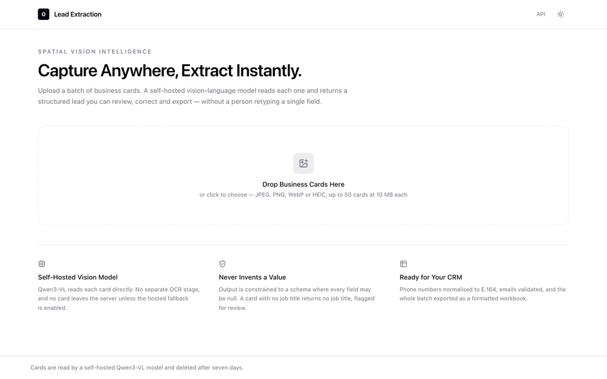
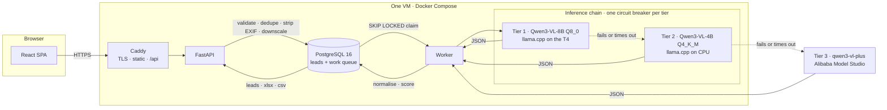
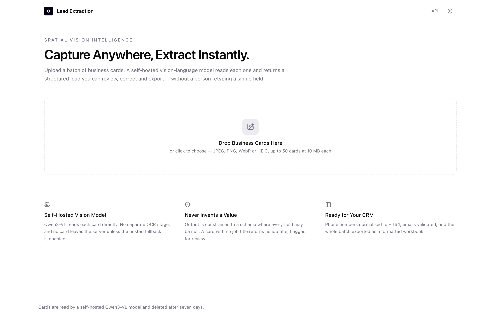
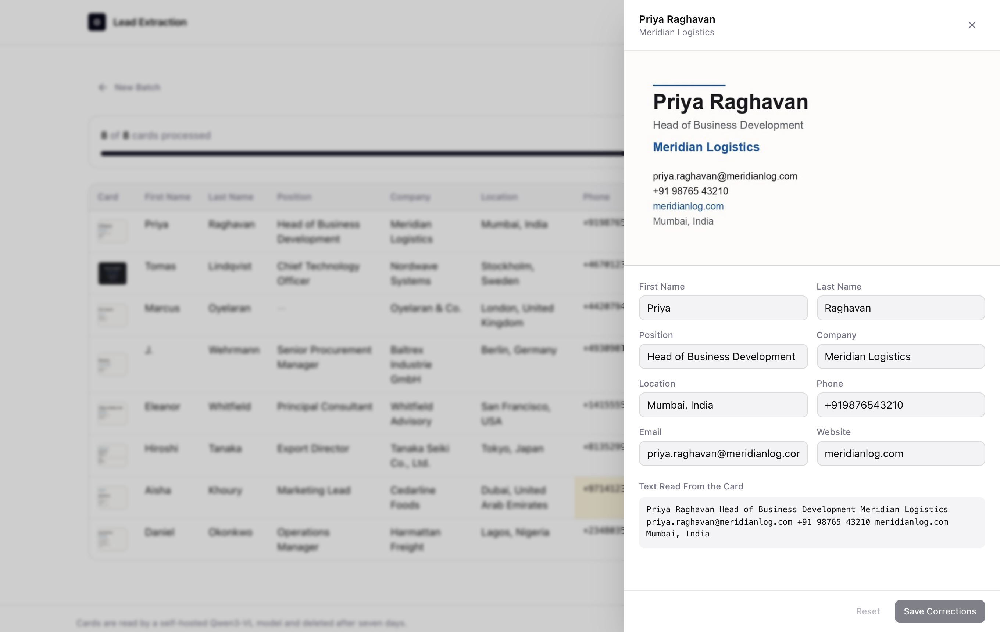
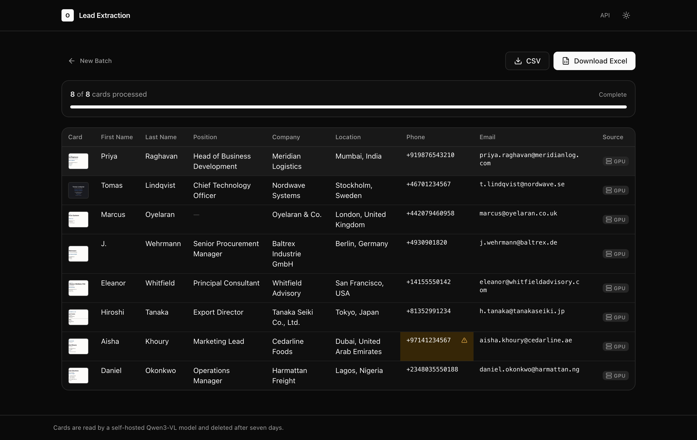

<div align="center">

# Business Card Lead Extraction

**Turn a pile of business cards into a clean, verified lead list — using a self-hosted vision-language model.**

Upload cards in bulk · extract seven structured fields per card · review and correct in the browser · export a formatted Excel workbook.

**[Open the live app →](https://muditagrawal-20-80-103-145.sslip.io)**

[Setup guide](docs/SETUP.md) · [Architecture](docs/ARCHITECTURE.md) · [Design decisions](docs/DECISIONS.md) · [Evaluation](docs/EVALUATION.md) · [Runbook](docs/RUNBOOK.md)

</div>



<div align="center"><sub>Eight cards, uploaded to the live deployment and extracted on the GPU tier in real time. No cuts.</sub></div>

---

## Contents

- [Live deployment](#live-deployment)
- [What it does](#what-it-does)
- [How it works](#how-it-works)
- [Measured results](#measured-results)
- [Screenshots](#screenshots)
- [Quick start](#quick-start)
- [Configuration](#configuration)
- [API](#api)
- [Testing](#testing)
- [Deployment](#deployment)
- [Project structure](#project-structure)
- [Known limits](#known-limits)
- [Privacy and data handling](#privacy-and-data-handling)

---

## Live deployment

| | |
|---|---|
| **URL** | <https://muditagrawal-20-80-103-145.sslip.io> — TLS by Let's Encrypt, no login |
| **Runs on** | One `Standard_NC4as_T4_v3` VM on Azure (Central US): 4 vCPU, 28 GB, one NVIDIA T4 16 GB |
| **Serving** | Qwen3-VL-8B-Instruct Q8_0 on the GPU as tier 1; Qwen3-VL-4B Q4_K_M on the CPU as tier 2 |
| **Measured** | A warm server clears an 8-card batch in **41 seconds** — about 9 s per card, two in flight — and scored **100 %** on the evaluation set from the public URL |

**Why Azure, when the brief said AWS.** The stack was built for AWS and first went live there on an `m7i-flex.large` (the free-tier-equivalent, CPU profile), where a card takes about 113 s. AWS then declined the G-instance vCPU quota for a new account — the standard answer, appealed and escalated to the EC2 service team, still pending at the time of writing. Azure approved a T4 in fifteen minutes. The Compose file, the images and the bootstrap logic are the same on both clouds; the only Azure-specific code is an 85-line script that installs the NVIDIA driver and container toolkit the AWS image ships pre-installed. Both paths are documented in the [setup guide](docs/SETUP.md), and the AWS deployment comes back with one command when the quota lands.

## What it does

Sales teams come back from a conference with fifty business cards and no way to get them into a CRM except by typing. This tool reads them.

**Extracted per card:** First Name · Last Name · Position · Company · Location · Phone · Email

**Also captured:** website, the postal address split into parts, secondary phones and emails, the full text the model read, and a per-field confidence score.

Three properties make the output usable rather than merely plausible:

| | |
|---|---|
| **It never invents a value** | Output is constrained to a schema where every field may be `null`. A card with no job title returns no job title — flagged for review, not filled with something plausible. |
| **Values are normalised, not just transcribed** | Phone numbers become E.164, emails are validated, honorifics and suffixes are stripped from names, and one primary phone is chosen from however many the card lists. |
| **Every row is attributable** | Each lead records which model read it, how it was decoded, and how long it took. A batch that spanned inference tiers is never presented as though it did not. |

## How it works



A card is never sent to a single point of failure. Each one runs through an ordered chain of inference tiers, each behind its own circuit breaker:

| Tier | Model | Where | Latency/card (measured) |
|---|---|---|---|
| 1 | Qwen3-VL-8B-Instruct (Q8_0) | Self-hosted, NVIDIA T4 | **9–12 s** warm; 34 s for the first card after a restart |
| 2 | Qwen3-VL-4B-Instruct (Q4_K_M) | Self-hosted, CPU | 113 s median on 2 vCPUs; ~20 s on Apple Silicon |
| 3 | Qwen3-VL (hosted Qwen API) | Alibaba Model Studio | ~3–6 s |

If a tier fails or times out, the next takes over. After three consecutive failures its breaker opens and it is skipped until a probe succeeds — without that, a dead GPU container would cost every card in a 50-card batch a full timeout before falling through. The queue is PostgreSQL itself (`SELECT … FOR UPDATE SKIP LOCKED` with leases), so a worker that dies mid-card loses nothing and there is no broker to operate. The full diagrams — request flow, per-card processing, data model — are in [docs/ARCHITECTURE.md](docs/ARCHITECTURE.md).

### Structured output

On the self-hosted tiers the JSON schema is compiled into a grammar, so the model **cannot** emit malformed JSON or unknown fields. Hosted providers vary, so the client degrades through `json_schema` → `json_object` → mining the first JSON object out of the text, with one repair attempt that feeds the validation error back. The rung that succeeded is stored per card, which keeps accuracy comparisons between tiers honest.

Every field is **required but nullable**: the model must answer for each one, and an explicit `null` is a valid answer. That distinction is what took field accuracy from 82.1 % to 100 % on the evaluation set — an *optional* field in a grammar is one the model may silently skip, and it did.

### No separate OCR engine

Qwen3-VL reads card text directly and more accurately than a CRAFT/CRNN pipeline; feeding EasyOCR output into it would add a worse signal to a better reader. Docling is a PDF/DOCX layout converter that delegates to an OCR engine for images, so "Docling + EasyOCR" is EasyOCR plus a large dependency tree — and EasyOCR pulls in PyTorch, ~800 MB of RAM better spent on a larger model. Full reasoning in [docs/DECISIONS.md](docs/DECISIONS.md).

## Measured results

Every figure here comes from `eval/run_eval.py` or from the deployed service, not from impressions.

| Model | Where | Image | Field accuracy | Perfect cards | Latency/card |
|---|---|---|---|---|---|
| Qwen3-VL-8B Q8_0 | **Live, T4 GPU** | 768 px | **100.0 %** | 8 / 8 | 8.7–12.1 s (8.9 s median) |
| Qwen3-VL-8B Q8_0 | Apple Silicon, Metal | 768 px | **100.0 %** | 8 / 8 | 64.4 s p50 |
| Qwen3-VL-4B Q4_K_M | Apple Silicon, Metal | 768 px | **100.0 %** | 8 / 8 | 20.6 s p50 |
| Qwen3-VL-4B Q4_K_M | AWS `m7i-flex.large`, 2 vCPU | 768 px | — | 7 / 8 completed | 113 s median; one card hit the 600 s ceiling |

The card set is eight synthetic cards built around the layouts that break extraction: a dark centred card, one with no job title, a first name given only as an initial, an honorific and suffix, two people on one card, a slogan where a company name usually sits, and a card listing mobile, office and fax.

> **This is not a production accuracy claim.** Those cards are clean renders with perfect focus and no glare, skew or creases. They isolate reasoning and schema failures — which is what they were built for, and they caught a real one — but they do not test perception. Both models now score full marks, so the set can no longer distinguish them; harder input is the next evaluation priority. See [docs/EVALUATION.md](docs/EVALUATION.md) for what remains unmeasured.

## Screenshots

<table>
<tr>
<td width="50%"></td>
<td width="50%"></td>
</tr>
<tr>
<td><em>Bulk upload — up to 50 cards, downscaled in the browser before upload.</em></td>
<td><em>Review a card against what the model read, and correct any field.</em></td>
</tr>
<tr>
<td colspan="2"></td>
</tr>
<tr>
<td colspan="2"><em>Light, dark and system themes; the palette is taken from O-HIVE's own design system. The amber cell is a number whose country code the model could not confirm from the card — hover the icon and it says so.</em></td>
</tr>
</table>

## Quick start

**Requires** Docker, Python 3.12, Node 22, [uv](https://docs.astral.sh/uv/), and [llama.cpp](https://github.com/ggml-org/llama.cpp). The [setup guide](docs/SETUP.md) walks through every step, including production on either cloud.

```bash
make install        # backend and frontend dependencies
make models         # Qwen3-VL weights (~13 GB, resumable; TIERS=cpu for just the 4B)
make db-up          # PostgreSQL on port 5433
make migrate
```

Then, in separate terminals:

```bash
make llama-cpu      # serve the 4B model on 127.0.0.1:18081
make dev            # API, worker and frontend
```

Open <http://localhost:5173>. The API documents itself at <http://localhost:8000/api/docs>.

<details>
<summary><strong>Why the unusual ports?</strong></summary>

The development database uses **5433** and the model servers **18080/18081**, rather than the defaults. A locally installed PostgreSQL usually holds 5432 and — being bound to `127.0.0.1` — silently wins the connection over Docker's wildcard bind, producing a confusing "role does not exist" error against the wrong database. Port 8080 is similarly contested (Airflow, Spark and Tomcat all default to it), and pointing the app at an unrelated service produces a failure that looks like a model problem.

Production is unaffected: Compose addresses the model servers by container name on an internal network.
</details>

## Configuration

Every setting is an environment variable with a safe default, so one image runs unchanged across local, GPU and CPU-profile deployments. Copy `.env.example` and edit. The full set is documented there; the ones that matter most:

| Variable | Default | Purpose |
|---|---|---|
| `DATABASE_URL` | — | PostgreSQL DSN. A sync `postgresql://` scheme is rewritten to `postgresql+asyncpg://` rather than silently blocking the event loop. |
| `VLM_GPU_ENABLED` | `true` | Tier 1. Disable on a CPU-only host so the chain does not spend a timeout on an absent server. |
| `VLM_CLOUD_API_KEY` | — | Tier 3. **A cloud tier with no key is treated as disabled**, so a missing secret degrades to the self-hosted tiers instead of failing every card. |
| `IMAGE_MAX_EDGE_PX` | `768` | Long-edge cap on images sent to the model. The dominant latency lever. |
| `MAX_FILES_PER_JOB` | `50` | Batch ceiling. Exceeding it returns 413 naming the limit. |
| `WORKER_CONCURRENCY` | `2` | Cards in flight. Set to 1 on CPU — llama.cpp on two vCPUs gains nothing from parallel requests. |
| `RETENTION_DAYS` | `7` | After this, batches, leads and images are deleted. |
| `APP_ACCESS_CODE` | *(empty)* | Optional passcode gating the endpoints that cost inference time. |

## API

Interactive documentation at [`/api/docs`](https://muditagrawal-20-80-103-145.sslip.io/api/docs). All routes are under `/api/v1`.

| Method | Path | Purpose |
|---|---|---|
| `POST` | `/jobs` | Upload 1–50 images. Returns accepted, duplicate and rejected counts. |
| `GET` | `/jobs/{id}` | Batch progress, per-card state, and a completion estimate. |
| `GET` | `/jobs/{id}/leads` | Extracted leads. |
| `PATCH` | `/leads/{id}` | Correct a lead. Only fields sent are changed. |
| `GET` | `/jobs/{id}/export.xlsx` · `.csv` | Download the batch. |
| `POST` | `/jobs/{id}/tasks/{id}/retry` | Requeue a failed card. |
| `GET` | `/images/{id}` · `/thumb` | Card image and thumbnail. |
| `GET` | `/health` · `/ready` · `/stats` | Liveness, readiness, per-tier throughput. |
| `DELETE` | `/jobs/{id}` | Purge a batch immediately. |

An invalid file is reported individually rather than failing the batch — twenty cards and one screenshot yields nineteen leads and one clear message.

```bash
curl -X POST https://muditagrawal-20-80-103-145.sslip.io/api/v1/jobs \
  -F "files=@card-one.jpg" -F "files=@card-two.jpg"
```

## Testing

```bash
make test           # 192 backend, 7 frontend
make lint           # ruff, pyright, eslint, tsc
make eval           # field accuracy against the known-answer card set
```

Unit tests run on in-memory SQLite and are dependency-free; behaviour that is genuinely PostgreSQL-specific (`SKIP LOCKED` claiming, JSONB) is covered by integration tests. The fixture enables `PRAGMA foreign_keys` explicitly — without it SQLite ignores foreign keys, `ON DELETE CASCADE` does nothing, and a cascade test passes while asserting behaviour PostgreSQL does not share.

CI runs both suites, builds both container images, and applies every migration forward, backward and forward again. An irreversible migration is otherwise discovered during a rollback, which is the worst possible moment.

## Deployment

One VM running Docker Compose behind Caddy, which terminates TLS and serves the built SPA. Two profiles over one Compose file:

```bash
docker compose --env-file .env -f deploy/docker-compose.prod.yml --profile gpu up -d --build
docker compose --env-file .env -f deploy/docker-compose.prod.yml --profile cpu up -d --build
```

The `cpu` profile is the same stack without the GPU container. The API and worker images are identical between them, so switching is configuration rather than a second deployment.

| Cloud | Instance | Bootstrap | Notes |
|---|---|---|---|
| AWS | `g4dn.xlarge` (T4) | `deploy/ec2/user-data-gpu.sh` | Deep Learning Base AMI: driver and container toolkit pre-installed |
| AWS | `m7i-flex.large` (CPU) | `deploy/ec2/user-data-cpu.sh` | The free-tier-equivalent; 4B model only |
| Azure | `Standard_NC4as_T4_v3` (T4) | `deploy/azure/bootstrap-gpu.sh` | Installs the driver and toolkit, then runs the EC2 script unchanged |

Every bootstrap verifies the GPU is visible *from inside a container*, downloads weights with retries, and waits for `/api/v1/ready` rather than reporting success when containers start. No domain is needed: [sslip.io](https://sslip.io) resolves the IP-encoded host name and Caddy obtains a real certificate for it.

<details>
<summary><strong>What "free tier" turned out to mean</strong></summary>

**No AWS free-tier instance can run this.** The free-tier-eligible types have 1–2 GB of RAM and the smallest usable Qwen VLM needs about 3 GB with its vision projector. AWS has no free GPU hours either. What exists is the new-account credit pool, which covers a `g4dn.xlarge` (~$0.54/h) for about a week — *if* the G-instance quota is granted, and a new account starts at zero. Ours was declined at first line and is with the EC2 service team on appeal. The Free Plan also cannot change instance type or launch anything outside six free-tier types, so the CPU deployment there is capped at 2 vCPUs, which is where the 113 s per card comes from.

Azure's new-subscription credit ($200) covers the T4 VM (~$0.59/h) for the evaluation window, and its quota process — a support ticket, free on every plan — answered in fifteen minutes. The [setup guide](docs/SETUP.md) documents both quota gates so the next person does not rediscover them.
</details>

## Project structure

```
backend/          FastAPI application, extraction worker, ORM, tests
  app/api/        HTTP routes
  app/services/   ingestion, normalisation, export, storage, queue
  app/vlm/        provider chain, circuit breakers, prompts, schema
  app/worker/     queue poller
frontend/         React 19 + TypeScript SPA
deploy/           Compose files, Caddyfile, EC2 and Azure bootstraps
eval/             Card set, ground truth, accuracy harness, recorded runs
docs/             Setup guide, architecture, decisions, evaluation, runbook
scripts/          Model download
```

**Stack:** Python 3.12 · FastAPI · SQLAlchemy 2 (async) · Alembic · PostgreSQL 16 · llama.cpp · React 19 · TypeScript · Vite · Tailwind CSS 4 · TanStack Query · Motion · openpyxl · Docker · Caddy

## Known limits

- **Accuracy on real photographs is not yet measured.** The evaluation set is synthetic.
- **One person per card.** A card showing two contacts yields the more prominent one, with the other described in the notes field.
- **Front and back are separate cards.** They are not merged.
- **PDFs are not accepted** — images only, stated in the upload error.
- **Non-Latin scripts are transcribed, not transliterated**, which is correct but untested for accuracy.
- **Single instance.** Storage is a local volume; scaling horizontally needs the S3 backend the storage interface already allows for.

## Privacy and data handling

- Batches, leads and images are deleted after `RETENTION_DAYS` (7 by default), and a user can purge a batch immediately.
- Uploads have **EXIF stripped on ingest**, so stored images carry no GPS trail — a phone photo of a card records where it was taken, and nothing downstream needs that.
- Client IP addresses are stored **only as a salted hash**: enough to rate limit and audit, not enough to make the database personal data on its own.
- With the hosted tier enabled, a card that both self-hosted tiers fail is sent to Alibaba Model Studio in Singapore. Rows processed that way are badged in the UI, and the tier can be switched off entirely.
- Card text is treated as data, never as instruction. Grammar-constrained output means text printed on a card cannot change the response shape.

## Licence

MIT
