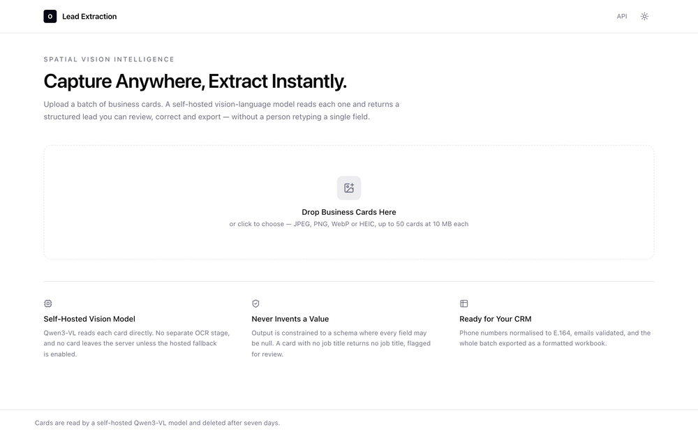
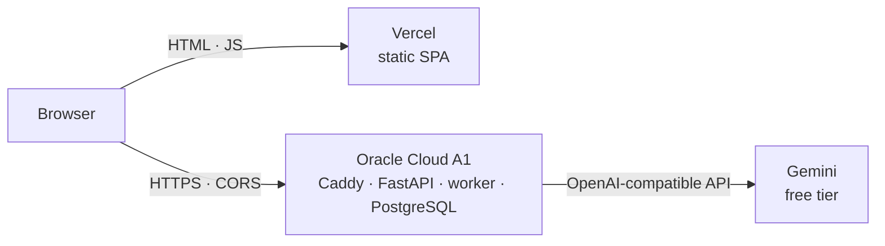
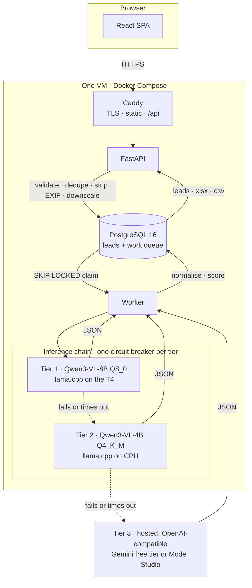
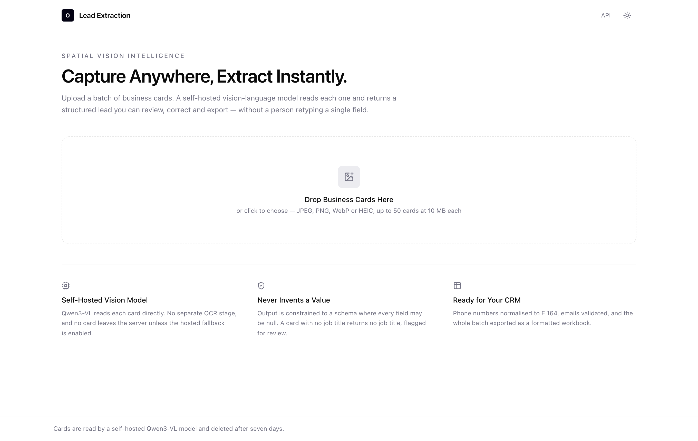
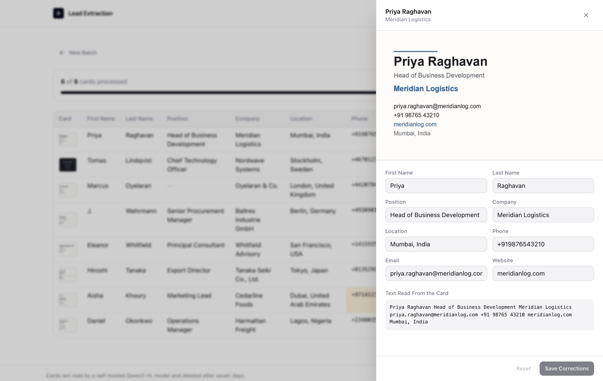
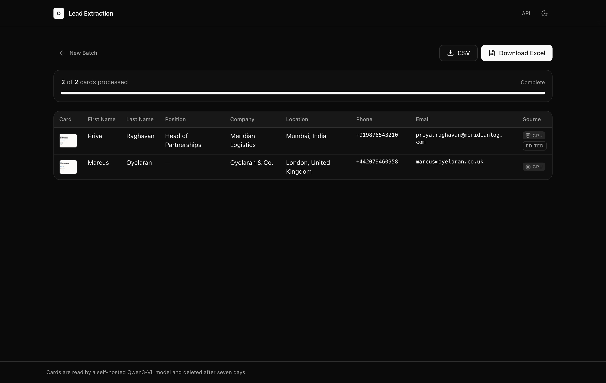

<div align="center">

# Business Card Lead Extraction

**Turn a pile of business cards into a clean, verified lead list — using a self-hosted vision-language model.**

Upload cards in bulk · extract seven structured fields per card · review and correct in the browser · export a formatted Excel workbook.

**[Open the live app →](https://muditagrawal-lead-extraction.vercel.app)**

[Setup guide](docs/SETUP.md) · [Architecture](docs/ARCHITECTURE.md) · [Design decisions](docs/DECISIONS.md) · [Evaluation](docs/EVALUATION.md) · [Runbook](docs/RUNBOOK.md)

<sub>O-Hive take-home, Assignment 1 · **Mudit Agrawal**</sub>

</div>



<div align="center"><sub>Eight cards, uploaded to the GPU deployment and extracted on the T4 in real time. No cuts.</sub></div>

### Watch the demo

[](docs/media/demo.mp4)

<div align="center"><sub>▶ Under ninety seconds, subtitled, recorded on the GPU deployment; the batch is shown at 4× speed, marked on screen. Music: "Inspired" by Kevin MacLeod (incompetech.com), <a href="https://creativecommons.org/licenses/by/4.0/">CC BY 4.0</a>.</sub></div>

---

## For the reviewer

| Asked for | Where it is |
|---|---|
| Publicly accessible deployed application | <https://muditagrawal-lead-extraction.vercel.app>: frontend on Vercel, API on Oracle Cloud. See [Live deployment](#live-deployment) |
| Source code | This repository: <https://github.com/muditagrawal-alt/VLM_Business_Card_Lead_Extraction> |
| Setup and deployment instructions | [Quick start](#quick-start) and [Deployment](#deployment) here; the full walkthrough for both clouds in [docs/SETUP.md](docs/SETUP.md) |
| Architecture and major technical decisions | [How it works](#how-it-works), then [docs/ARCHITECTURE.md](docs/ARCHITECTURE.md) and [docs/DECISIONS.md](docs/DECISIONS.md) |
| Libraries, frameworks, pretrained models, external components | [Components](#libraries-frameworks-models-and-external-components) |
| Known limitations and what I would improve | [Known limitations and what I would improve with more time](#known-limitations-and-what-i-would-improve-with-more-time) |
| AI usage | [AI Usage](#ai-usage) |

## Contents

- [Live deployment](#live-deployment)
- [What it does](#what-it-does)
- [How it works](#how-it-works)
- [Measured results](#measured-results)
- [Screenshots](#screenshots)
- [Quick start](#quick-start)
- [Configuration](#configuration)
- [API](#api)
- [Testing](#testing)
- [Deployment](#deployment)
- [Project structure](#project-structure)
- [Libraries, frameworks, models and external components](#libraries-frameworks-models-and-external-components)
- [Known limitations and what I would improve with more time](#known-limitations-and-what-i-would-improve-with-more-time)
- [Guardrails on the public URL](#guardrails-on-the-public-url)
- [Privacy and data handling](#privacy-and-data-handling)
- [AI Usage](#ai-usage)

---

## Live deployment

**<https://muditagrawal-lead-extraction.vercel.app>**. Free and open to anyone, with no login and no access code. Per-address limits and a daily ceiling on the hosted key bound what one visitor, or all of them together, can use; [Guardrails](#guardrails-on-the-public-url) has the details.

| | |
|---|---|
| **Frontend** | The built SPA on Vercel, with a Content-Security-Policy that allows exactly the API's origin |
| **API** | `https://muditagrawal-129-146-106-98.sslip.io`: Caddy, FastAPI, the worker and PostgreSQL on an Oracle Cloud Always Free Ampere A1 instance (1 OCPU / 6 GB, Phoenix), TLS by Let's Encrypt |
| **Model** | Gemini 3.6 Flash on Google's free tier, falling back to 3.1 Flash-Lite. The page names the model and warns that the free tier may use submitted cards |
| **Measured** | A three-card batch through the public site in **33 s**, 100 % on the evaluation set, and nothing to pay |


```mermaid
flowchart LR
    B[Browser] -- "HTML · JS" --> V["Vercel<br/>static SPA"]
    B -- "HTTPS · CORS" --> C["Oracle Cloud A1<br/>Caddy · FastAPI · worker · PostgreSQL"]
    C -- "OpenAI-compatible API" --> G["Gemini<br/>free tier"]
```

The browser calls the API directly, not through Vercel's proxy. Proxied, every request would arrive from Vercel's addresses, and the per-address rate limits would stop meaning one visitor. [Decision 14](docs/DECISIONS.md) has the reasoning, and the [setup guide](docs/SETUP.md#the-live-deployment-frontend-on-vercel-api-on-oracle-cloud) has the procedure.

**Earlier deployments.** They are kept here because every self-hosted figure in this README was measured on them.

| Where | When | Served | Measured |
|---|---|---|---|
| Azure `Standard_NC4as_T4_v3`, one NVIDIA T4 | 18–25 Sept | Qwen3-VL-8B Q8_0 on the GPU, 4B on the CPU | An 8-card batch in 41 s, about 9 s a card, and 100 % on the evaluation set. The demo video and screenshots were recorded here |
| AWS `m7i-flex.large`, 2 vCPU | September | Qwen3-VL-4B on the CPU | About 113 s a card |

**Why the brief's AWS is not the live host.** The stack was built for AWS and first went live there, on the free-tier-equivalent CPU instance. AWS then declined the GPU quota for a new account, and the appeal went to the EC2 service team. Azure approved a T4 in fifteen minutes and served the review window, and the GPU was then shut down to stop spending credit. The live deployment now costs nothing. The same Compose file and images run on all of these clouds, and every path is in the [setup guide](docs/SETUP.md).

## What it does

Sales teams come back from a conference with fifty business cards and no way to get them into a CRM except by typing. This tool reads them.

**Extracted per card:** First Name · Last Name · Position · Company · Location · Phone · Email

**Also captured:** website, the postal address split into parts, secondary phones and emails, the full text the model read, and a per-field confidence score.

Three properties make the output usable rather than merely plausible:

| | |
|---|---|
| **It never invents a value** | Output is constrained to a schema where every field may be `null`. A card with no job title returns no job title — flagged for review, not filled with something plausible. |
| **Values are normalised, not just transcribed** | Phone numbers become E.164, emails are validated, honorifics and suffixes are stripped from names, and one primary phone is chosen from however many the card lists. |
| **Every row is attributable** | Each lead records which model read it, how it was decoded, and how long it took. A batch that spanned inference tiers is never presented as though it did not. |

## How it works


```mermaid
flowchart TB
    subgraph browser [Browser]
        UI[React SPA]
    end
    subgraph vm ["One VM · Docker Compose"]
        Caddy["Caddy<br/>TLS · static · /api"]
        API[FastAPI]
        PG[("PostgreSQL 16<br/>leads + work queue")]
        W[Worker]
        subgraph chain ["Inference chain · one circuit breaker per tier"]
            direction LR
            T1["Tier 1 · Qwen3-VL-8B Q8_0<br/>llama.cpp on the T4"]
            T2["Tier 2 · Qwen3-VL-4B Q4_K_M<br/>llama.cpp on CPU"]
        end
    end
    T3["Tier 3 · hosted, OpenAI-compatible<br/>Gemini free tier or Model Studio"]

    UI -- HTTPS --> Caddy --> API
    API -- "validate · dedupe · strip EXIF · downscale" --> PG
    PG -- "SKIP LOCKED claim" --> W
    W --> T1 -. "fails or times out" .-> T2 -. "fails or times out" .-> T3
    T1 & T2 & T3 -- JSON --> W
    W -- "normalise · score" --> PG
    PG -- "leads · xlsx · csv" --> API
```

A card is never sent to a single point of failure. Each one runs through an ordered chain of inference tiers, each behind its own circuit breaker:

| Tier | Model | Where | Latency/card (measured) |
|---|---|---|---|
| 1 | Qwen3-VL-8B-Instruct (Q8_0) | Self-hosted, NVIDIA T4 | **9–12 s** warm; 34 s for the first card after a restart |
| 2 | Qwen3-VL-4B-Instruct (Q4_K_M) | Self-hosted, CPU | 113 s median on 2 vCPUs; ~20 s on Apple Silicon |
| 3 | Gemini 3.6 Flash, or qwen3-vl-plus | Hosted, any OpenAI-compatible API | 16.6 s p50 on Gemini's free tier, mostly backoff after shed requests |

If a tier fails or times out, the next takes over. A hosted tier first retries a 429 or 5xx, honouring `Retry-After`, and fails over across a list of models, because free tiers shed load and retire models. After three consecutive failures its breaker opens and it is skipped until a probe succeeds — without that, a dead GPU container would cost every card in a 50-card batch a full timeout before falling through. The queue is PostgreSQL itself (`SELECT … FOR UPDATE SKIP LOCKED` with leases), so a worker that dies mid-card loses nothing and there is no broker to operate. The full diagrams — request flow, per-card processing, data model — are in [docs/ARCHITECTURE.md](docs/ARCHITECTURE.md).

### Structured output

On the self-hosted tiers the JSON schema is compiled into a grammar, so the model **cannot** emit malformed JSON or unknown fields. Gemini accepts the same strict schema and answered every evaluation card on it. Hosted providers vary, so for one that does not, the client degrades through `json_schema` → `json_object` → mining the first JSON object out of the text, with one repair attempt that feeds the validation error back. The rung that succeeded is stored per card, which keeps accuracy comparisons between tiers honest.

Every field is **required but nullable**: the model must answer for each one, and an explicit `null` is a valid answer. That distinction is what took field accuracy from 82.1 % to 100 % on the evaluation set — an *optional* field in a grammar is one the model may silently skip, and it did.

### No separate OCR engine

Qwen3-VL reads card text directly and more accurately than a CRAFT/CRNN pipeline; feeding EasyOCR output into it would add a worse signal to a better reader. Docling is a PDF/DOCX layout converter that delegates to an OCR engine for images, so "Docling + EasyOCR" is EasyOCR plus a large dependency tree — and EasyOCR pulls in PyTorch, ~800 MB of RAM better spent on a larger model. Full reasoning in [docs/DECISIONS.md](docs/DECISIONS.md).

## Measured results

Every figure here comes from `eval/run_eval.py` or from the deployed service, not from impressions.

| Model | Where | Image | Field accuracy | Perfect cards | Latency/card |
|---|---|---|---|---|---|
| Qwen3-VL-8B Q8_0 | **T4 GPU deployment** | 768 px | **100.0 %** | 8 / 8 | 8.7–12.1 s (8.9 s median) |
| Gemini 3.6 Flash | **Hosted, free tier** | 768 px | **100.0 %** | 8 / 8 | 16.6 s p50, mostly free-tier backoff |
| Qwen3-VL-8B Q8_0 | Apple Silicon, Metal | 768 px | **100.0 %** | 8 / 8 | 64.4 s p50 |
| Qwen3-VL-4B Q4_K_M | Apple Silicon, Metal | 768 px | **100.0 %** | 8 / 8 | 20.6 s p50 |
| Qwen3-VL-4B Q4_K_M | AWS `m7i-flex.large`, 2 vCPU | 768 px | — | 7 / 8 completed | 113 s median; one card hit the 600 s ceiling |

Beyond the synthetic set, two batches of **real** cards were run through the GPU deployment and graded by hand against the images (the cards themselves are not published — they belong to real people):

| Set | Cards | Fields correct | Perfect cards | Notes |
|---|---|---|---|---|
| Business-card images from the web | 9 | 61 / 63 (96.8 %) | 7 / 9 | Both misses are judgement calls: a domain used as the company when none is printed; "Any City" shortened to "Any". Every placeholder number (`+123-456-7890`) was kept as printed and flagged. |
| Scanned cards from a wallet, front and back | 14 sides | 93 / 98 (94.9 %) | 11 / 14 | Fronts alone: 48 / 49. Misses: two Devanagari words on a Hindi-only side, a department line read as a position on a back, and a ® that is now stripped. |

The card set is eight synthetic cards built around the layouts that break extraction: a dark centred card, one with no job title, a first name given only as an initial, an honorific and suffix, two people on one card, a slogan where a company name usually sits, and a card listing mobile, office and fax.

> **This is not a production accuracy claim.** Those cards are clean renders with perfect focus and no glare, skew or creases. They isolate reasoning and schema failures — which is what they were built for, and they caught a real one — but they do not test perception. Every model now scores full marks, so the set can no longer distinguish them; harder input is the next evaluation priority. See [docs/EVALUATION.md](docs/EVALUATION.md) for what remains unmeasured.

## Screenshots

<table>
<tr>
<td width="50%"></td>
<td width="50%"></td>
</tr>
<tr>
<td><em>Bulk upload — up to 50 cards, downscaled in the browser before upload.</em></td>
<td><em>Review a card against what the model read, and correct any field.</em></td>
</tr>
<tr>
<td colspan="2"></td>
</tr>
<tr>
<td colspan="2"><em>Light, dark and system themes; the palette is taken from O-HIVE's own design system. The amber cell is a number whose country code the model could not confirm from the card — hover the icon and it says so.</em></td>
</tr>
</table>

## Quick start

**Requires** Docker, Python 3.12, Node 22, [uv](https://docs.astral.sh/uv/), and [llama.cpp](https://github.com/ggml-org/llama.cpp). The [setup guide](docs/SETUP.md) walks through every step, including production on either cloud.

```bash
make install        # backend and frontend dependencies
make models         # Qwen3-VL weights (~13 GB, resumable; TIERS=cpu for just the 4B)
make db-up          # PostgreSQL on port 5433
make migrate
```

Then, in separate terminals:

```bash
make llama-cpu      # serve the 4B model on 127.0.0.1:18081
make dev            # API, worker and frontend
```

Open <http://localhost:5173>. The API documents itself at <http://localhost:8000/api/docs>.

<details>
<summary><strong>Why the unusual ports?</strong></summary>

The development database uses **5433** and the model servers **18080/18081**, rather than the defaults. A locally installed PostgreSQL usually holds 5432 and — being bound to `127.0.0.1` — silently wins the connection over Docker's wildcard bind, producing a confusing "role does not exist" error against the wrong database. Port 8080 is similarly contested (Airflow, Spark and Tomcat all default to it), and pointing the app at an unrelated service produces a failure that looks like a model problem.

Production is unaffected: Compose addresses the model servers by container name on an internal network.
</details>

## Configuration

Every setting is an environment variable with a safe default, so one image runs unchanged across local, GPU, CPU and hosted deployments. Copy `.env.example` and edit. The full set is documented there; the ones that matter most:

| Variable | Default | Purpose |
|---|---|---|
| `DATABASE_URL` | — | PostgreSQL DSN. A sync `postgresql://` scheme is rewritten to `postgresql+asyncpg://` rather than silently blocking the event loop. |
| `VLM_GPU_ENABLED` | `true` | Tier 1. Disable on a CPU-only host so the chain does not spend a timeout on an absent server. |
| `VLM_CLOUD_API_KEY` | — | Tier 3. **A cloud tier with no key is treated as disabled**, so a missing secret degrades to the self-hosted tiers instead of failing every card. |
| `VLM_CLOUD_MODEL` | `qwen3-vl-plus` | A comma-separated list, tried in order when a model is retired or busy. |
| `VLM_CLOUD_DAILY_REQUEST_LIMIT` | `1000` | Hosted requests per UTC day across all workers, so the public URL cannot drain the key. |
| `IMAGE_MAX_EDGE_PX` | `768` | Long-edge cap on images sent to the model. The dominant latency lever. |
| `MAX_FILES_PER_JOB` | `50` | Batch ceiling. Exceeding it returns 413 naming the limit. |
| `WORKER_CONCURRENCY` | `2` | Cards in flight. Set to 1 on CPU — llama.cpp on two vCPUs gains nothing from parallel requests. |
| `RETENTION_DAYS` | `7` | After this, batches, leads and images are deleted. |
| `RATE_LIMIT_IMAGES_PER_HOUR` | `100` | Cards per client address per hour. |
| `APP_ACCESS_CODE` | *(empty)* | Optional passcode for uploading, retrying and deleting; it can travel in the link as `/?code=…`. |
| `APP_CORS_ORIGINS` | *(empty)* | Browser origins allowed to call the API: the static host, when the SPA is served there. |

## API

Interactive documentation at `/api/docs` on any deployment. All routes are under `/api/v1`.

| Method | Path | Purpose |
|---|---|---|
| `POST` | `/jobs` | Upload 1–50 images. Returns accepted, duplicate and rejected counts. † |
| `GET` | `/jobs/{id}` | Batch progress, per-card state, and a completion estimate. |
| `GET` | `/jobs/{id}/leads` | Extracted leads. |
| `PATCH` | `/leads/{id}` | Correct a lead. Only fields sent are changed. |
| `GET` | `/jobs/{id}/export.xlsx` · `.csv` | Download the batch. |
| `POST` | `/jobs/{id}/tasks/{id}/retry` | Requeue a failed card. † |
| `GET` | `/images/{id}` · `/thumb` | Card image and thumbnail. |
| `GET` | `/health` · `/ready` · `/stats` | Liveness, readiness, per-tier throughput. |
| `DELETE` | `/jobs/{id}` | Purge a batch immediately. † |

† Requires the `X-Access-Code` header when `APP_ACCESS_CODE` is set. There is deliberately no route that lists batches: without accounts it would hand every visitor's leads to anyone.

An invalid file is reported individually rather than failing the batch — twenty cards and one screenshot yields nineteen leads and one clear message.

```bash
curl -X POST https://<host>/api/v1/jobs -H "X-Access-Code: <code>" \
  -F "files=@card-one.jpg" -F "files=@card-two.jpg"
```

## Testing

```bash
make test           # 220 backend, 12 frontend
make lint           # ruff, pyright, eslint, tsc
make eval           # field accuracy against the known-answer card set
```

Unit tests run on in-memory SQLite and are dependency-free; behaviour that is genuinely PostgreSQL-specific (`SKIP LOCKED` claiming, JSONB) is covered by integration tests. The fixture enables `PRAGMA foreign_keys` explicitly — without it SQLite ignores foreign keys, `ON DELETE CASCADE` does nothing, and a cascade test passes while asserting behaviour PostgreSQL does not share.

CI runs both suites, builds both container images, and applies every migration forward, backward and forward again. An irreversible migration is otherwise discovered during a rollback, which is the worst possible moment.

## Deployment

One VM running Docker Compose behind Caddy, which terminates TLS and serves the built SPA. The live deployment moves the SPA to Vercel and keeps the rest on the VM. Three profiles over one Compose file:

```bash
docker compose --env-file .env -f deploy/docker-compose.prod.yml --profile gpu up -d --build
docker compose --env-file .env -f deploy/docker-compose.prod.yml --profile cpu up -d --build
docker compose --env-file .env -f deploy/docker-compose.prod.yml --profile hosted up -d --build
```

The `cpu` profile is the same stack without the GPU container; `hosted` runs no model server at all and sends every card to the hosted tier, so it fits a machine with about a gigabyte of memory. The API and worker images are identical across all three, so switching is configuration rather than a second deployment.

| Cloud | Instance | Bootstrap | Notes |
|---|---|---|---|
| AWS | `g4dn.xlarge` (T4) | `deploy/ec2/user-data-gpu.sh` | Deep Learning Base AMI: driver and container toolkit pre-installed |
| AWS | `m7i-flex.large` (CPU) | `deploy/ec2/user-data-cpu.sh` | The free-tier-equivalent; 4B model only |
| Azure | `Standard_NC4as_T4_v3` (T4) | `deploy/azure/bootstrap-gpu.sh` | Installs the driver and toolkit, then runs the EC2 script unchanged |
| Any | ~1 GB, no GPU | `make deploy-hosted` | Hosted profile: no weights to download, every card to the hosted tier |
| Oracle Cloud | Always Free Ampere A1 (arm64) | `deploy/oracle/bootstrap.sh` | Hosted profile; also opens ports 80 and 443 in the host firewall, which Oracle's images close |
| Vercel | Static | `frontend/vercel.json` | The SPA alone, built with `VITE_API_BASE_URL` pointing at the API |

Every bootstrap verifies the GPU is visible *from inside a container*, downloads weights with retries, and waits for `/api/v1/ready` rather than reporting success when containers start. No domain is needed: [sslip.io](https://sslip.io) resolves the IP-encoded host name and Caddy obtains a real certificate for it.

<details>
<summary><strong>What "free tier" turned out to mean</strong></summary>

**No AWS free-tier instance can run this.** The free-tier-eligible types have 1–2 GB of RAM and the smallest usable Qwen VLM needs about 3 GB with its vision projector. AWS has no free GPU hours either. What exists is the new-account credit pool, which covers a `g4dn.xlarge` (~$0.54/h) for about a week — *if* the G-instance quota is granted, and a new account starts at zero. Ours was declined at first line and is with the EC2 service team on appeal. The Free Plan also cannot change instance type or launch anything outside six free-tier types, so the CPU deployment there is capped at 2 vCPUs, which is where the 113 s per card comes from.

Azure's new-subscription credit ($200) covers the T4 VM (~$0.59/h) for the evaluation window, and its quota process — a support ticket, free on every plan — answered in fifteen minutes. The [setup guide](docs/SETUP.md) documents both quota gates so the next person does not rediscover them.
</details>

## Project structure

```
backend/          FastAPI application, extraction worker, ORM, tests
  app/api/        HTTP routes
  app/services/   ingestion, normalisation, export, storage, queue
  app/vlm/        provider chain, circuit breakers, prompts, schema
  app/worker/     queue poller
frontend/         React 19 + TypeScript SPA
deploy/           Compose files, Caddyfile, EC2 and Azure bootstraps
eval/             Card set, ground truth, accuracy harness, recorded runs
docs/             Setup guide, architecture, decisions, evaluation, runbook
scripts/          Model download
```

## Libraries, frameworks, models and external components

### Pretrained models

| Model | Format | Where it runs | Source |
|---|---|---|---|
| **Qwen3-VL-8B-Instruct** | GGUF, Q8_0 (8.3 GB) + F16 vision projector (1.1 GB) | Tier 1, llama.cpp on the T4 | [`Qwen/Qwen3-VL-8B-Instruct-GGUF`](https://huggingface.co/Qwen/Qwen3-VL-8B-Instruct-GGUF), Apache-2.0 |
| **Qwen3-VL-4B-Instruct** | GGUF, Q4_K_M (2.4 GB) + F16 projector (0.8 GB) | Tier 2, llama.cpp on CPU | [`Qwen/Qwen3-VL-4B-Instruct-GGUF`](https://huggingface.co/Qwen/Qwen3-VL-4B-Instruct-GGUF), Apache-2.0 |
| Gemini 3.6 Flash, falling back to 3.1 Flash-Lite | hosted | Tier 3 on the free deployment | Google AI Studio, OpenAI-compatible endpoint |
| qwen3-vl-plus | hosted | Tier 3, alternative provider | Alibaba Model Studio, OpenAI-compatible endpoint |

No other model, OCR engine or embedding is used. The VLM is the OCR. Weights are downloaded by `scripts/download_models.sh` with resume and GGUF magic-byte verification; they are never committed.

### Inference and data

| Component | Version | Role |
|---|---|---|
| llama.cpp `llama-server` | `ghcr.io/ggml-org/llama.cpp:server-cuda` / `:server` | Serves both GGUF models with an OpenAI-compatible API; compiles the JSON schema to a GBNF grammar so output cannot be malformed |
| PostgreSQL | 16 | Leads, batches, and the work queue (`FOR UPDATE SKIP LOCKED` with leases) — no broker |
| Caddy | 2 | TLS from Let's Encrypt, static SPA, `/api` reverse proxy, security headers |

### Backend (Python 3.12)

| Library | Version | Role |
|---|---|---|
| FastAPI · uvicorn | 0.141 · 0.53 | HTTP API; the same image runs the worker |
| SQLAlchemy (async) · asyncpg · Alembic | 2.0.52 · 0.31 · 1.20 | ORM, driver, migrations (applied forward, back and forward again in CI) |
| Pydantic · pydantic-settings | 2.13 · 2.15 | One schema is the VLM grammar, the API contract and the Excel columns |
| httpx · tenacity | 0.28 · 9 | Provider client with timeouts and retries |
| phonenumbers | 9.0 | E.164 parsing with three validity levels, region inferred from sibling numbers, TLD or country |
| email-validator · nameparser | 2.3 · 2.3 | Email syntax, honorific and suffix stripping |
| Pillow · pillow-heif · pillow-jxl-plugin | 12.3 · 1.7 · 1.3 | EXIF orientation, metadata stripping, downscaling; HEIC and JPEG XL input |
| openpyxl | 3.1 | Formatted workbook export with a summary sheet |
| structlog · slowapi | 26.1 · 0.1 | Structured logging; rate limiting on the endpoints that cost inference |
| Swagger UI | 5.33, vendored at build | API documentation served same-origin so it works under the CSP |

### Frontend (TypeScript 5.7)

| Library | Version | Role |
|---|---|---|
| React · Vite | 19.2 · 6 | SPA, hash-routed, two views |
| Tailwind CSS | 4 | Styling; tokens taken from O-HIVE's design system |
| TanStack Query · TanStack Table | 5 · 8 | Polling job state, the leads grid |
| Motion | 13 | Progress and drawer animation, honouring reduced-motion |
| Radix UI (dialog, tooltip, progress) · lucide-react | 1.1 · 0.474 | Accessible primitives and icons |
| react-dropzone · browser-image-compression | 14 · 2 | Drop zone; downscale before upload so a 50-card batch is not 500 MB |
| zod | 3.24 | API response validation at the boundary |

### Development and delivery

pytest · pytest-asyncio · respx · aiosqlite · ruff · pyright · Vitest · Testing Library · ESLint · Prettier · Playwright (screenshots and the demo recording) · Docker Compose · GitHub Actions.

### Cloud and external services

| Service | Used for |
|---|---|
| Azure `Standard_NC4as_T4_v3`, Central US | The GPU deployment, 18–25 September (quota via support ticket, approved in ~15 min); shut down to stop spending credit |
| AWS EC2 `m7i-flex.large`, us-east-1 | The first deployment, CPU profile; the GPU quota appeal is with the EC2 service team |
| Oracle Cloud, Always Free Ampere A1, Phoenix | The live API: Caddy, FastAPI, the worker and PostgreSQL |
| Vercel | The live frontend |
| sslip.io · Let's Encrypt | A public host name and a real certificate without buying a domain |
| Hugging Face Hub | Model weights, fetched at deploy time |
| Google AI Studio (Gemini API) | The hosted tier on its free plan |
| Alibaba Model Studio | Alternative hosted provider for tier 3 |
| incompetech.com | Demo-video music, *"Inspired"* by Kevin MacLeod, CC BY 4.0 |

## Known limitations and what I would improve with more time

### Limitations as shipped

| Limitation | Why | How it could be lifted |
|---|---|---|
| **A number printed without a country code, on a card with no other country signal, is kept as printed and flagged** | The alternative is guessing a region, and an early build that assumed `+1` fabricated valid-looking US numbers for Indian cards | Infer the region from the postal-code format and city; or a per-batch default region the user sets once |
| **Non-Latin text is transcribed, not transliterated**, and Devanagari is less reliable than Latin | Two words on a Hindi-only side were misread; the English side of the same card was perfect | Prefer the Latin side when both exist (done); measure Devanagari on a larger set; consider a larger projector resolution for dense scripts |
| **One person per card, and a card's front and back are separate rows** | The schema is one lead per image | Merge sides that share an email or phone; a "two people" card could yield two rows |
| **The model will sometimes use a domain as the company** when no company name is printed | Defensible inference, but the design says never to invent | Reject a company that equals the website's domain at normalisation |
| **PDFs are not accepted** | Images only; the error says so | Rasterise the first page with `pdfium` |
| **The first card after a server restart takes ~34 s** | CUDA kernels compile and the projector runs cold | Send a warm-up request at boot before reporting ready |
| **Single instance, local storage** | Enough for the assignment; the storage interface already allows an S3 backend | S3 for images, more than one worker, a managed PostgreSQL |
| **The free hosted tier is slower and less predictable than the GPU** | About one request in seven is shed, and the backoff puts the median at 16.6 s against 8.9 s on the T4 | A paid tier, or the GPU again when the AWS quota lands |
| **Gemini's free tier may use submitted cards** to improve Google's products | The provider's free-tier terms | The paid tier, or the self-hosted tiers, for real contacts |
| **The live API is one small ARM instance** | Always Free: 1 OCPU / 6 GB. On a free-tier account, Oracle may reclaim an instance that sits idle for a week | Upgrade the account to Pay As You Go, where Always Free resources stay free and are not reclaimed |
| **No login** | Out of scope per the brief. The live demo is open to anyone, so per-address limits and the daily ceiling are what bound its use | Accounts, so a batch belongs to a person and limits follow the person rather than the address |

### What I would do first

- **A harder evaluation set with ground truth.** The synthetic set is saturated at 100 % and the real cards were graded by hand. Two hundred photographed cards with agreed answers would turn "96.8 %" into a number that can be tracked release to release.
- **A scale-to-zero GPU tier.** The app on a small always-on VM, the T4 started when a batch arrives and deallocated after fifteen idle minutes. It is designed — the GPU is already just a URL to the worker — but it trades a three-minute cold start for a 95 % cost cut, and for a review window the warm GPU mattered more.
- **Bring the GPU deployment back to AWS** when the quota appeal lands. It is one command; the AWS path is documented and tested.
- **Region inference from the address**, so Indian cards stop showing amber on every mobile number.
- **The hosted tier on the real cards.** Gemini matches the 8B on the synthetic set, but the web and wallet cards have only been graded on the self-hosted tier.


## Guardrails on the public URL

There are no accounts, so anything the URL exposes is exposed to whoever has the link. The layers that stop misuse of the deployment and of the hosted key:

| Guardrail | What it stops |
|---|---|
| **No endpoint lists batches** | Reading other visitors' leads. A batch is reachable only by its id, an unguessable UUID the uploader's browser keeps. |
| **Optional access code on upload, retry and delete** | Strangers spending inference or emptying the database. Compared in constant time and shareable as `/?code=…`. It gated the demo during the review; the demo is open now, and the rows below are what bound it. |
| **Per-address limits** | One caller flooding the queue: batches per ten minutes and cards per hour. |
| **A daily ceiling on the hosted key** | Many callers draining the quota together. Shared by every worker in PostgreSQL, so a restart does not reset it. |
| **Cached health probes** | Using the public readiness endpoint to call the provider on the key. |
| **The key never leaves the server** | It is not sent to the browser or written to the logs. |

Each one is covered by tests; [docs/SETUP.md](docs/SETUP.md#7-guardrails-for-a-public-url) has the settings.

## Privacy and data handling

- Batches, leads and images are deleted after `RETENTION_DAYS` (7 by default), and a user can purge a batch immediately.
- Uploads have **EXIF stripped on ingest**, so stored images carry no GPS trail — a phone photo of a card records where it was taken, and nothing downstream needs that.
- Client IP addresses are stored **only as a salted hash**: enough to rate limit and audit, not enough to make the database personal data on its own.
- With the hosted tier enabled, cards reach the configured provider: Google's Gemini API, or Alibaba Model Studio in Singapore. **On Gemini's free tier, Google may use submitted content to improve its products**, so the free deployment is for sample cards, not real contacts. Rows read by the hosted tier are badged in the UI, and the tier can be switched off entirely.
- Card text is treated as data, never as instruction. Grammar-constrained output means text printed on a card cannot change the response shape.

## AI Usage

### Tools

**Claude Code** (Anthropic) was my development assistant for the whole project: implementation, tests, deployment scripting, the evaluation harness, and the first drafts of the documentation. I also used its browser and Playwright tooling to take the screenshots and record the demo. No other AI tool was used, and no AI is in the product's request path except the Qwen model that *is* the product.

### How it was used

The working arrangement was that I owned the problem, the decisions and the acceptance bar, and used the assistant as a fast implementer that had to show its work:

- **I set the scope and the constraints up front** — the seven fields the brief asks for, self-hosted Qwen with an offline-first build, a production-grade bar rather than a prototype, no versions or milestones ("we are building the final end product"), and O-HIVE's own design language for the interface.
- **I decided the shape of the system**: GPU primary, CPU fallback, hosted fallback, in that order; PostgreSQL rather than a broker; a single VM with two Compose profiles; no authentication for the assignment.
- **I supplied the test material and the verdicts.** The real cards came from the web and from a wallet at home; I looked at what came back, said which extractions were wrong, and sent them back to be fixed one at a time. The evaluation set, the ground truth, and the rule that a number is *never* guessed all came out of those rounds.
- **I ran the cloud accounts**: AWS, then GCP, then Azure, then Oracle Cloud and Vercel. I filed the quota requests and the appeal, chose Azure when it was the one that said yes, and chose Vercel for the frontend and Oracle for the API when the goal became a deployment that costs nothing.
- **I decided when to stop spending.** After the review window I shut the GPU down, asked for a way to keep the app running for nothing, and asked for guardrails so that nobody could misuse the key or the deployment.
- The assistant did most of the implementation under that direction — code, tests, deployment scripts — ran the evaluation sweeps, drafted the docs, and did the debugging legwork when something broke.

### Recommendations adopted, after they earned it

| Recommendation | Why it was kept |
|---|---|
| **No separate OCR engine.** My first plan was Docling + EasyOCR feeding the model. The assistant argued that Qwen3-VL already reads text better than a CRAFT/CRNN pipeline, that Docling is a document converter that would just call EasyOCR for images, and that the ~800 MB of RAM would buy a bigger model instead | I took the argument; the results held. Every card in the evaluation set is read correctly with no OCR stage at all |
| **Qwen3-VL-8B Q8_0 as the primary, 4B Q4_K_M as the fallback**, both on llama.cpp | The 4B matches the 8B on the evaluation set and is a third the latency on CPU, which is what made a CPU fallback tier credible |
| **The queue lives in PostgreSQL** (`SKIP LOCKED` with leases) rather than Redis or Celery | One fewer service to operate, crash recovery for free, and the queue and the leads are in one transaction |
| **Per-tier circuit breakers** | Without them a dead GPU container costs every card in a batch a full timeout before falling through |
| **Required-but-nullable fields in the grammar** | This was a fix to the assistant's own first design — see below — and it took the evaluation from 82.1 % to 100 % |
| **Removing the endpoint that listed every batch** | Found while auditing for the guardrails I asked for. With no accounts, it let anyone read everyone's leads; the frontend never used it, so it went |
| **Gemini's free tier through the existing client** | I asked whether Gemini's free version would work. Before answering, the assistant checked Gemini's OpenAI-compatible endpoint against the request the client already sends; it was a configuration change, and it then scored 100 % |
| **Calling the API directly from the browser rather than through Vercel's proxy** | The proxy's limit on request size is not documented, and a full upload is about 15 MB. Proxied requests would also all come from Vercel's addresses, merging every visitor into one rate-limit bucket |
| **A test that fails when a setting cannot reach the containers** | A new setting had been silently dropped by the compose file twice. The guard found fourteen more, including a worker concurrency the CPU deployment had never actually used |
| **A daily ceiling on the hosted key, kept in the database** | Per-address limits cannot stop several addresses draining one quota, and an in-memory counter resets with the container |
| **Self-hosting Swagger UI instead of loosening the Content-Security-Policy** | The demo recording showed the docs page blank in production. The assistant proposed vendoring the assets over relaxing the policy; that is the right instinct and it is what shipped |

### Recommendations rejected or modified

| What was proposed | What happened to it |
|---|---|
| **Optional fields in the output schema** (the first implementation) | **Modified after measurement.** The model silently skipped optional fields and scored 82.1 %. Making every field required, with `null` an explicit answer, took it to 100 %. The assistant designed the original; the evaluation caught it |
| **Falling back to a US region when parsing a number with no country code** | **Rejected.** It produced a "valid" `+1 705 555 9999` for an Indian card — fabricated data with a confidence score. Replaced with region inference from sibling numbers, the email domain and the printed country, and *no* guess otherwise. A flagged number beats a wrong one |
| **A projected T4 latency of "2–4 s per card"** in an early README draft | **Rejected as a claim.** Nothing that was not measured goes in the README. The measured figure on the GPU deployment was 9–12 s, and that is what it says |
| **MLX on Apple Silicon** to cut local latency further | **Abandoned.** The downloads failed repeatedly on my network and the gain was unverified, so the script was removed rather than shipped as a maybe |
| **Version milestones** (a v1 to submit, a v2 to polish) | **Rejected.** I wanted one final product with a clean, structured history, and that is how the repository is built |
| **Adding authentication** | **Rejected for scope.** The brief does not ask for it; a passcode option exists in configuration for anyone who needs the gate |
| **Scheduled GPU hours and a scale-to-zero GPU tier** to conserve credit | **Declined.** O-HIVE is in the US, so I kept the GPU warm around the clock during the review window, then shut it down altogether. The scale-to-zero design is written up above |
| **Alibaba Model Studio as the free hosted option** | **Modified on my requirement.** It was the first suggestion, but its free quota is one million tokens for ninety days; I wanted something completely free, which is how the hosted tier ended up on Gemini |
| **`gemini-2.5-flash` as the hosted model** | **Replaced after it failed.** It returns 404 to new accounts. The tier now takes a list of models and fails over, so the next retirement is a log line rather than an outage |
| **An Excel summary that read "Flagged for review: 0"** while the sheet showed amber cells | **Fixed on my report.** I noticed the contradiction in the export; the count now looks at each field rather than each row |

> The pattern across all of these is the same: the assistant is fast and usually right, and the times it was wrong were caught by looking at real output — a fabricated phone number, a skipped field, a blank docs page, a summary row that contradicted its own sheet, an endpoint that handed out everyone's leads, a compression worker quietly fetching its code from a CDN. The measurement and the looking were my job, and they are the reason the numbers in this README can be trusted.

## Licence

MIT
