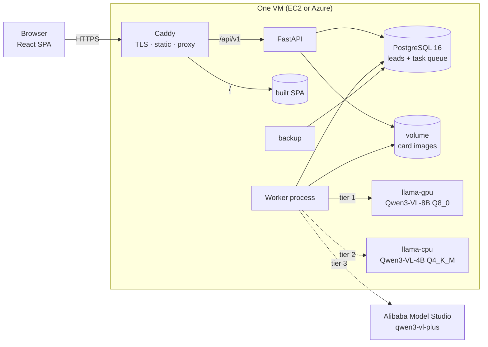
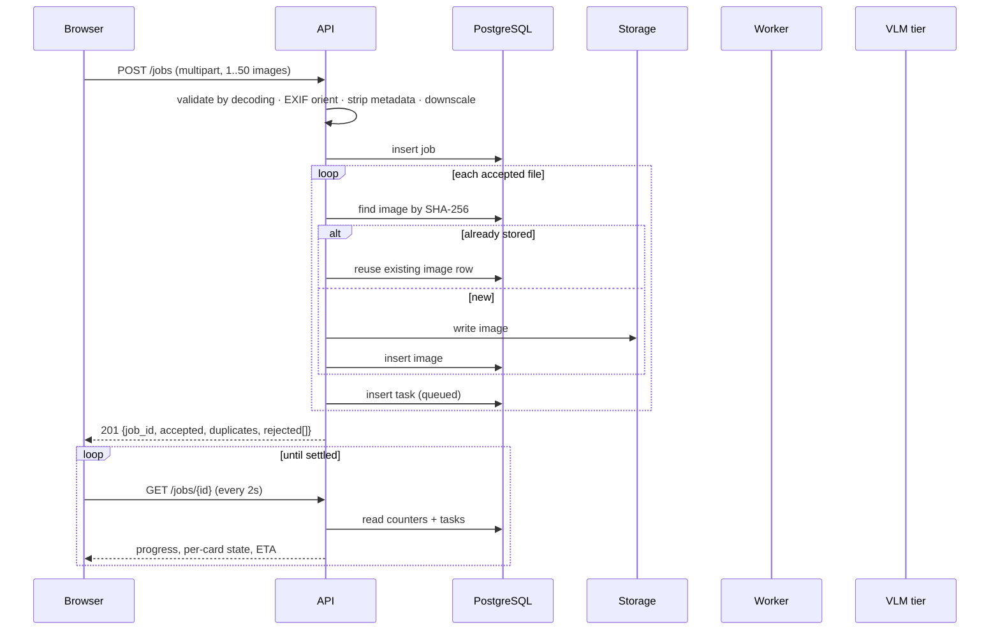
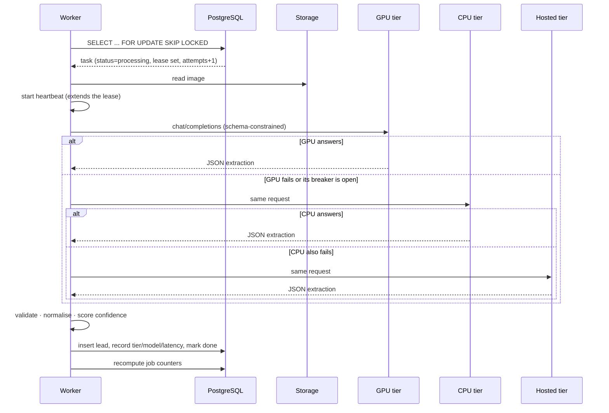

# Architecture

## Components



Only Caddy is reachable from the internet. Both model servers listen on the
compose network alone, so nothing can reach inference without going through the
API's validation and rate limits.

The `cpu` profile is this diagram without `llama-gpu`. The API and worker
images are identical between profiles.

## Request flow: uploading a batch



A file that cannot be decoded is reported in `rejected[]` rather than failing
the batch. The response distinguishes *accepted* from *duplicates*, because a
duplicate costs no inference.

## Processing one card



If every tier fails, the task returns to the queue while attempts remain, and
is marked failed once they are exhausted so the batch can settle. A failed card
is retryable by hand from the UI.

## Why the queue lives in PostgreSQL

The claim query is the whole mechanism:

```sql
SELECT * FROM tasks
WHERE attempts < :max_attempts
  AND (status = 'queued'
       OR (status = 'processing' AND lease_until < now()))
ORDER BY created_at
LIMIT :n
FOR UPDATE SKIP LOCKED;
```

- `SKIP LOCKED` lets several workers claim disjoint rows without coordinating.
- The `lease_until` clause is crash recovery: a worker that dies mid-card
  leaves a lease that lapses, and the row becomes claimable again.
- `attempts` is incremented at claim time, not on failure, so a card that
  reliably kills its worker cannot be retried forever.

Job counters are recomputed from the tasks rather than incremented, because an
increment drifts — a card that fails once and then succeeds would be counted
twice.

## Data model

```mermaid
erDiagram
  JOBS ||--o{ TASKS : has
  JOBS ||--o{ LEADS : produces
  IMAGES ||--o{ TASKS : "read by"
  TASKS ||--o| LEADS : yields

  JOBS { uuid id; enum status; int total; int done; int failed; timestamp expires_at }
  IMAGES { uuid id; string sha256_unique; string storage_key; int width; int height }
  TASKS { uuid id; enum status; int attempts; timestamp lease_until; enum provider; int latency_ms; jsonb raw_response }
  LEADS { uuid id; string first_name; string last_name; string position; string company; string location; string phone; string email; jsonb confidence; bool edited_by_user }
```

`images` is keyed by content hash, so the same card uploaded twice is stored
once and reuses its extraction. Deleting a job cascades to its tasks and leads;
images are shared and left to the retention sweep.

## Trust boundaries

| Boundary | Treatment |
|---|---|
| Uploaded file | Validated by decoding, never by declared type or extension. Pixel cap against decompression bombs. |
| Card text | Data, never instruction. Grammar-constrained output means text on a card cannot change the response shape. |
| Model output | Validated against the schema; phones and emails re-validated independently. |
| User corrections | Normalised through the same code as extracted values. |
| Client IP | Stored only as a salted hash. |
| Hosted tier | Off-box. Disclosed per row in the UI and disableable entirely. |
